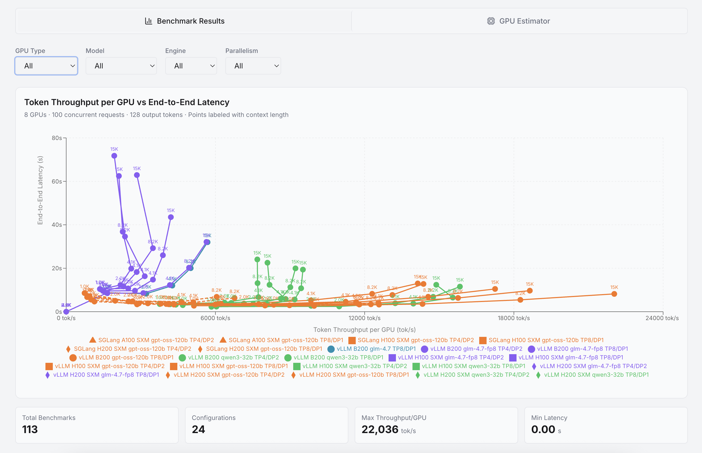
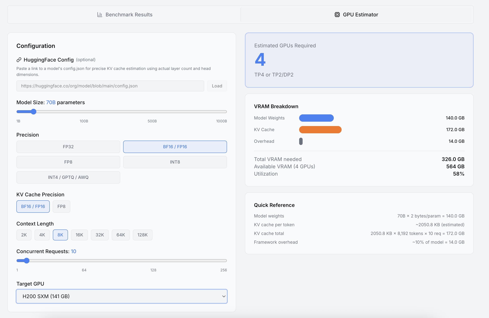

# GPU Calculator

LLM inference benchmark dashboard and GPU estimator built with Next.js.





## Features

- **Benchmark Results** — Interactive scatter plot of Token Throughput per GPU vs End-to-End Latency across B200, H200, H100, and A100 GPUs. Filter by GPU type, model, inference engine (vLLM / SGLang), and parallelism config.
- **GPU Estimator** — Estimate the number of GPUs needed for LLM inference based on model size, precision, context length, and concurrent requests. Optionally load a HuggingFace `config.json` for precise KV cache estimation using actual layer count and head dimensions.

## Benchmark Data

Data is sourced from [llm-benchmaq](https://github.com/Scicom-AI-Enterprise-Organization/llm-benchmaq) as a git submodule under `data/llm-benchmaq/`.

To sync latest benchmark data:

```bash
git submodule update --remote
```

## Running Locally

```bash
npm install
npm run dev
```

App runs at http://localhost:3000.

## Docker

```bash
docker compose up --build
```

## Tech Stack

- [Next.js 16](https://nextjs.org) — framework
- [React 19](https://react.dev) — UI
- [Recharts](https://recharts.org) — charting
- [Tailwind CSS v4](https://tailwindcss.com) — styling
- [Radix UI](https://www.radix-ui.com) — accessible components
